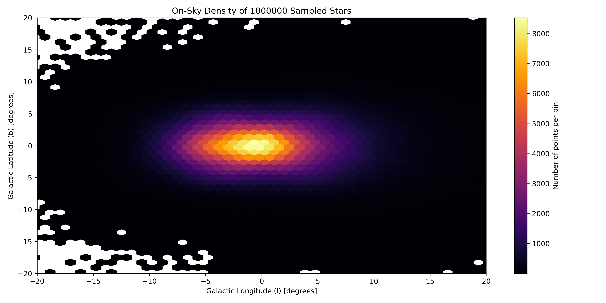

# Coleman Bulge Density Model

A JAX-based, differentiable implementation of the [Coleman et al. (2020)](https://academic.oup.com/mnras/article/495/3/3350/5838756) Milky Way bulge density model.

## Features

*   **JAX Backend & Auto-Diff**: Built on `jax.numpy`, allowing for gradient computations via `jax.grad`.
*   **Hybrid Evaluation**: Evaluates density using `jax.scipy.ndimage.map_coordinates` for coordinates within a pre-computed grid. It falls back to an analytical model for extrapolation outside the grid bounds.
*   **Vectorized & JIT-Compiled**: Vectorized and JIT-compiled (`@jax.jit`) to process large arrays of coordinates on CPU, GPU, or TPU.
*   **Flexible Coordinates**: Accepts inputs in either Sun-centered spherical coordinates (`r`, `lat`, `lon`) or Galactic Cartesian coordinates (`x`, `y`, `z`).

## Requirements

*   Python >= 3.8
*   JAX >= 0.4.0
*   NumPy >= 1.20.0
*   SciPy >= 1.7.0

## Installation

This package can be installed using `pip`:

```bash
pip install coleman-bulge-density-model
```

## Usage

To use the model, import the pre-instantiated `bulge_density_model`.

### Basic Evaluation

```python
import jax.numpy as jnp
from coleman_bulge_density import bulge_density_model

# 1. Using Galactic Cartesian coordinates (x, y, z)
density, in_bounds = bulge_density_model(x=8.0, y=0.0, z=0.0)

# 2. Processing large arrays
x_arr = jnp.linspace(0, 15, 100)
y_arr = jnp.zeros(100)
z_arr = jnp.zeros(100)
densities, bounds = bulge_density_model(x=x_arr, y=y_arr, z=z_arr)
```



### HMC & Gradients

The model is compatible with JAX operations, allowing for gradient calculations for use in physics simulations and HMC samplers.

```python
import jax
import jax.numpy as jnp
from coleman_bulge_density import bulge_density_model

def log_prob(position_vector):
    """Calculates the log-probability for a given (x, y, z) position."""
    density, _ = bulge_density_model(
        x=position_vector[0], 
        y=position_vector[1], 
        z=position_vector[2]
    )
    return jnp.log(density)

# Generate the gradient function
grad_log_prob = jax.grad(log_prob)

# Evaluate the gradient at a given position
position = jnp.array([8.0, 0.0, 0.0])
gradient = grad_log_prob(position)
```

